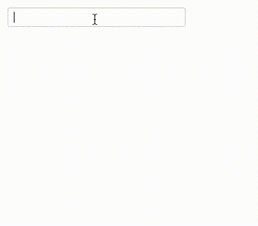

# react-geoinput

[](https://badge.fury.io/js/react-geoinput)
[](https://npmjs.org/package/react-geoinput)

> Description here.



## Features

* Suggestion of locations
* Address geocoding
* Customizable debounced input
* Customizable suggestion serialization and rendering
* Customizable geo destination serialization and rendering
* Standard `input` interface (compatible with `redux-form`)

## Install

```
npm install --save react-geoinput
```

## Try demo locally

```
git clone git clone https://github.com/woltapp/react-geoinput.git
cd react-geoinput
npm install
npm start
```

## What problem does the library solve?

TODO

## Examples

TODO

## API Documentation

TODO

## License

MIT
